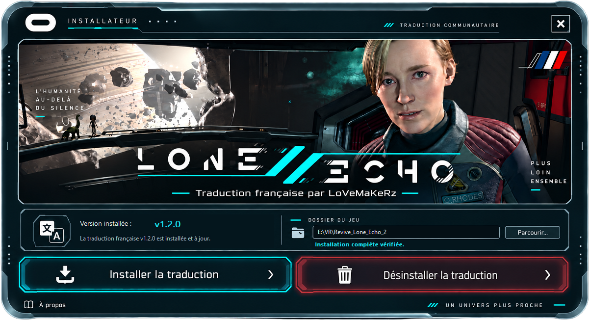
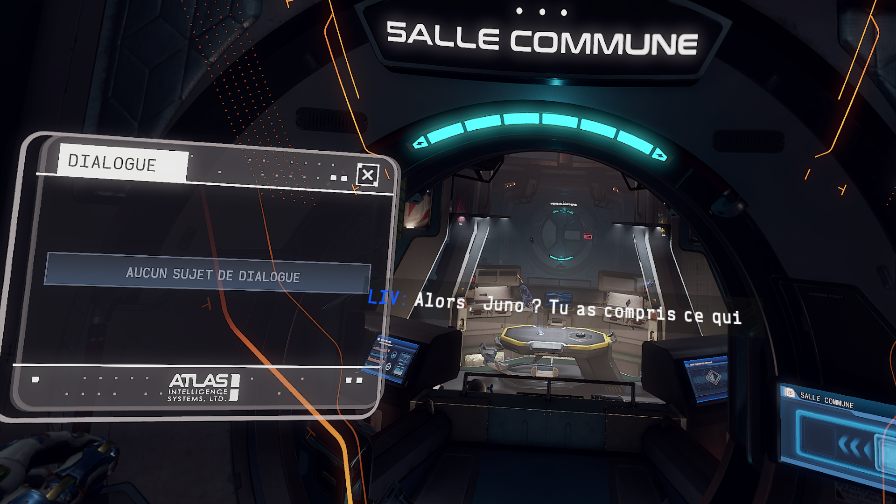

# Lone Echo II — Traduction française complète

**Traduction française non officielle réalisée par LoVeMaKeRz.**

Redécouvrez l’intégralité de l’aventure de **Lone Echo II** en français, tout en conservant au maximum le ton, le contexte et l’ambiance du jeu original.

La traduction couvre les **dialogues, sous-titres, interfaces, objectifs, descriptions et textes du jeu**. Un important travail de relecture et de contextualisation a été effectué pour éviter autant que possible les traductions littérales et proposer un français naturel, cohérent avec les personnages et les situations.

> **42 180 entrées traduites sur 42 180 identifiées.**  
> Ce chiffre couvre l’ensemble des entrées identifiées, mais ne garantit pas que chaque variante ait pu être vérifiée en jeu.

## Installation auto

Le téléchargement comprend un **installateur portable** spécialement conçu pour le patch. Il ne s’installe pas dans Windows et ne crée pas de programme permanent sur votre système.

1. Lancez l’outil de traduction.
2. Vérifiez le dossier du jeu détecté automatiquement. Si nécessaire, sélectionnez manuellement le dossier de **Lone Echo II** avec le bouton **Parcourir**.
3. Cliquez sur **Installer la traduction**.

Avant toute modification, les fichiers nécessaires sont sauvegardés afin de permettre un retour propre à la version anglaise.

| Bouton | Fonction |
| --- | --- |
| **Installer la traduction** | Installe les fichiers français dans Lone Echo II. |
| **Désinstaller la traduction** | Restaure les fichiers anglais d’origine sauvegardés lors de l’installation. |

## Installation Manuelle

Une installation manuelle est disponible et utilise Xdelta, spécialement conçu pour la plateforme NexusMods, qui refuse tout hébergement de fichiers exécutables (.exe, .bat, .cmd, .ps1, etc.).
Veuillez suivre le guide directement sur cette plateforme. (La version manuelle est disponible ici même ainsi que sur NexusMods.)
https://www.nexusmods.com/loneecho2/mods/4

## Qualité de la traduction

Le projet ne repose pas sur une simple traduction automatique appliquée en masse.

Les dialogues ont été retravaillés en tenant compte, autant que possible :

- du contexte et des lignes précédentes et suivantes ;
- de la personnalité des personnages ;
- de la situation dans laquelle ils apparaissent.

Certaines formulations ont volontairement été adaptées plutôt que traduites mot à mot, afin d’obtenir un résultat plus naturel en français.

Une attention particulière a également été portée à la cohérence des noms, des termes techniques, des personnages et des éléments importants de l’univers de **Lone Echo II**.

## Une traduction encore perfectible

Même si toutes les entrées identifiées ont été traduites et qu’un important travail de vérification a été effectué, **je ne considère pas cette version comme absolument parfaite à 100 %, mais elle est vraiment « propre »**.

Lone Echo II contient énormément de dialogues, de variantes, de réponses alternatives et de lignes déclenchées uniquement dans certaines situations très précises.

Il peut donc encore rester :

- quelques phrases en anglais ;
- certaines variantes de dialogues non détectées pendant les tests ;
- de petites erreurs de traduction ou de contexte ;
- quelques formulations pouvant être améliorées.

### Signaler un problème

N’hésitez pas à signaler toute anomalie en indiquant, si possible :

- **la phrase affichée** ;
- **le moment du jeu** ;
- **le contexte de la scène**.

Une **capture d’écran** est encore mieux ! Je ferai peut-être une mise à jour de la traduction par la suite, en fonction des retours.

## Compatibilité

La traduction est destinée à **Lone Echo II sur PC**. Elle modifie uniquement les ressources nécessaires à l’affichage des textes français et ne remplace pas le jeu original.

**Une copie légitime de Lone Echo II est nécessaire.**

Si une mise à jour du jeu modifie certains fichiers concernés par le patch, une nouvelle version de la traduction pourra être nécessaire.

## Désinstallation

Pour revenir à la version anglaise :

1. Lancez de nouveau l’outil de traduction.
2. Cliquez sur **Désinstaller la traduction**.

Les fichiers d’origine sauvegardés lors de l’installation seront restaurés.

Il n’est pas nécessaire de désinstaller un programme depuis Windows : l’outil lui-même est entièrement portable.

## À propos

**Lone Echo II — Traduction française non officielle**  
Traduction française réalisée par **LoVeMaKeRz**.

Ce projet communautaire gratuit n’est ni affilié aux détenteurs des droits de Lone Echo II, ni approuvé ou sponsorisé par eux.

Lone Echo II, ses marques, personnages, visuels et autres éléments associés restent la propriété de leurs détenteurs respectifs.

Ce patch nécessite une copie légitime de Lone Echo II et ne contient pas le jeu original.

## Remerciements

Merci à **Jimx78** pour sa patience, ses échanges, ses tests, sa réelle implication et son intérêt pour tous mes projets — hors arcade, il n’aime pas ça…

Merci également à **ma femme**, bien sûr, qui a maintes fois attendu que je vienne manger ou dormir ^^’

---

**Bon retour dans l’espace, et bonne aventure en français !**
